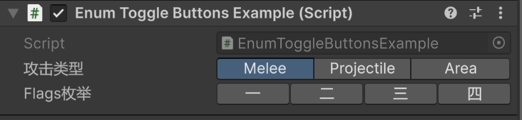

### EnumToggleButtons

#### 描述
unity原生Inspector对枚举的处理是显示成一个下拉框，该属性的作用是让枚举字段显示成一排列表，更加直观。

#### 示例

```csharp
[Flags]
public enum SomeEnumF {
    [InspectorName("一")]
    First=1,
    [InspectorName("二")]
    Second=2,
    [InspectorName("三")]
    Third=4,
    [InspectorName("四")]
    Forth=8
}
public enum AttackType {
    Melee,
    Projectile,
    Area
}
public class EnumToggleButtonsExample : MonoBehaviour {
    
    [InspectorLabel("攻击类型")]
    [EnumToggleButtons]
    public AttackType attackType;

    [InspectorLabel("Flags枚举")]
    [EnumToggleButtons]
    public SomeEnumF someEnumF;
}
```


#### 参数
该属性无参数

#### 细节
1. 如果被用在非Enum字段上，那么无任何事发生；
2. 如果被用在List\<Enum\>上，那么会穿透到列表元素上；
3. Flags枚举和普通枚举，按钮样式存在差异，前者的按钮是一排独立的按钮，后者的按钮是直接用`GUI.Toolbar`画出来的；