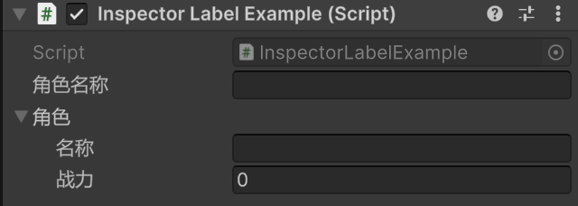

### InspectorLabelAttribute

#### 描述
该特性用在MonoBehaviour或Serializable类的字段上，用来控制字段在Inspector中显示的名称。

#### 示例
```csharp
[Serializable]
public class Character {

    [InspectorLabel("名称")]
    public string name;
    [InspectorLabel("战力")]
    public int stats;
}

public class InspectorLabelExample : MonoBehaviour {
    
    [InspectorLabel("角色名称")]
    public string characterName;

    [InspectorLabel("角色")]
    public Character character;
}
```



#### 参数
| 参数 | 含义 |
|:----:|------|
|Label|要在Inspector里显示的名字|