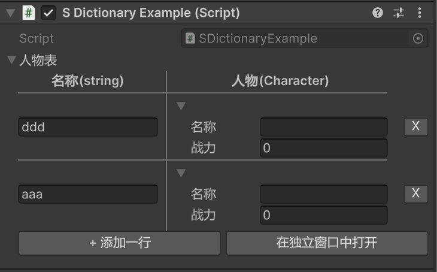

### SDictionary

#### 描述
unity原生不支持序列化Dictionary，但Dictionary又非常常用。这里提供一个unity原生能序列化和显示的SDictionary，名称前面的“S”就表示“Serializable”的首字母

#### 示例

```csharp
[Serializable]
public class Character {
    [InspectorLabel("名称")]
    public string name;
    [InspectorLabel("战力")]
    public int stats;
}
public class SDictionaryExample : MonoBehaviour {
    [InspectorLabel("人物表")]
    [SDictionaryLabel("名称", "人物")]
    public SDictionary<string, Character> characters;
}
```


#### 细节
1. SDictionary的原理是定义一个`Pair<K, V>`，再用一个List来储存键值对数据，运行时转化成原生dict；
2. 如果是在编辑器里运行，那么运行时修改SDicitonary会同步到储存键值对的原始List中，方便在编辑器里看到变化；
3. 如果是在真实设备上运行，那么不会同步List，以节省性能；
4. SDictionary被画成一个2列的表格；
5. 可以用SDictionaryLabel指定表头显示的名称；
6. 添加按钮在最底下，删除按钮在每一行的右边，有一个叉号按钮；
7. 很多时候值字段往往比键字段复杂，默认情况下键列占总宽度的40%，值列占总宽度的60%，中间的分隔线可以左右拖动；
8. 如果字段类型太复杂，可以点击“在独立窗口打开”，会显示一个大窗口，方便编辑；
9. 大窗口里也会显示底部的两个按钮，但是目前有一个bug：如果在大窗口里编辑已有的内容，那么正常，但是如果在大窗口里新增元素并编辑，那么会卡住，关闭再打开后恢复正常；
10. 如果键和值类型有任何一个不可序列化，那么整个字典不可序列化，整个字典字段完全不显示，此时这个字段不是null，而是一个空字典；

#### 字段是否可序列化：
判断序列化的逻辑是一个递归过程，适用于本项目的任何一个Attribute；
如果一个字段经过判断不可序列化，那么不显示
1. unity原生能序列化的类型可序列化；
2. 数组套数组、数组套List、List套数组、List套List、二维数组不可序列化；
3. 如果是一维数组，数组元素可序列化，则该字段可序列化；
4. 如果是一维List，List元素类型可序列化，则该字段可序列化；
5. 如果是SDictionary，键类型和值类型都可序列化，则该字段可序列化；