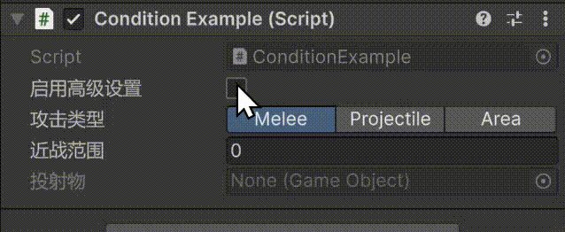

### ShowIf

#### 描述
条件显示，该特性用于在条件字段符合期望值时显示字段/使字段可编辑、在条件不满足时隐藏字段/。
该特性用在MonoBehaviour或Serializable类的字段上。

#### 示例

```csharp
public enum AttackType {
    Melee,
    Projectile,
    Area
}

public class ConditionExample : MonoBehaviour {
    [InspectorLabel("启用高级设置")]
    public bool advanced;

    [InspectorLabel("攻击类型"), EnumToggleButtons]
    public AttackType attackType;

    // advanced为true时显示
    [InspectorLabel("高级数值"), ShowIf("advanced")]
    public float advancedValue;

    // attackType为Melee时显示
    [InspectorLabel("近战范围"), ShowIf("attackType", AttackType.Melee)]
    public float meleeRange;

    //attackType为Projectile时可编辑
    [InspectorLabel("投射物"), EnableIf("attackType", AttackType.Projectile)]
    public GameObject projectilePrefab;
}
```


#### 参数
| 参数 |类型| 含义 |
|:----:|:-:|:------|
|conditionFieldName|`string`|条件字段名, 必须与Attribute所在字段位于同一个类|
|expectedValues|`object[]`|条件成立的期望值，当条件字段的值是该列表中的任意一个值时，条件成立，字段显示，反之不显示|

#### 细节
1. 条件字段的类型可以是`bool`或`Enum`
2. 如果条件字段/期望值的类型不是`bool`或`Enum`，那么ShowIf无效；
2. 条件字段必须与Attribute所在字段位于同一个类，否则无效；
4. 对于`bool`类型的条件字段，期望值一般写一个（一共就俩值），如果不写，默认为true
5. 对于`Enum`类型的条件字段，期望值可以写多个，表示条件字段是期望值中的任意一个时，显示该字段；
3. 如果条件字段和期望值的类型不匹配，那么ShowIf无效；
4. `EnableIf`与`ShowIf`参数格式一致，用来控制字段是否可编辑；