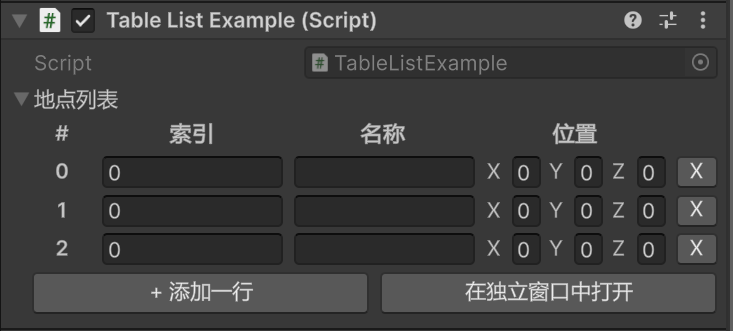

### TableList

#### 描述
unity原生Inspector默认是下拉显示，不方便编辑，该属性让`List`或数组显示成表格的形式；

```csharp
[Serializable]
public class Location {
    [TableName("索引")]
    public int id;

    [TableName("名称")]
    public string name;

    [TableName("位置")]
    public Vector3 posotion;
}

public class TableListExample : MonoBehaviour {

    [InspectorLabel("地点列表")]
    [TableList]
    public List<Location> locations;
}
```



#### 参数
该属性没有参数

#### 细节
1. 表格的添加按钮在最底下，删除按钮在每一行的最右边，有一个叉号；
2. 目前是平均分配表宽度到每一个字段，暂不支持调整列宽；
3. 如果字段类型太复杂，也可以点击“在独立窗口中打开”按钮，会弹出一个大窗口，方便编辑；
4. 实际上如果列表元素的字段里有很复杂的类，不推荐使用该属性；
5. 如果列表元素的字段里又标注了[ShowIf](./ShowIf&EnableIf.md)或[EnableIf](./ShowIf&EnableIf.md)，当某一个字段不应显示时，对应位置的单元格会变成空白，当某一列全变成空白时，暂不支持自动隐藏全空白列；
6. 如果列表的元素不是类，而是`int`、`float`等基本值，那么会画成一列，列名固定为“value”；
7. 如果列表元素的类型中没有可序列化的字段，则仅显示一个不可编辑的空列；
8. 可以用[TableName](./TableName.md)来指定表格的列名；
9. 如果类的字段中有`TableName`，优先用来决定这一列的列名，如果没有，就用`InspectorLabel`，如果二者都没有，就用字段原本的名字；