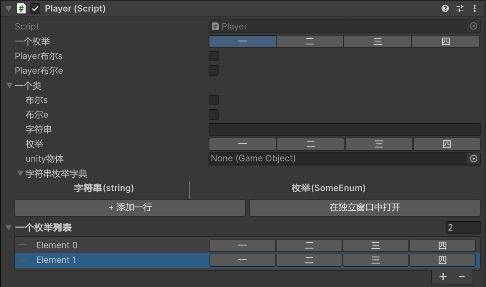
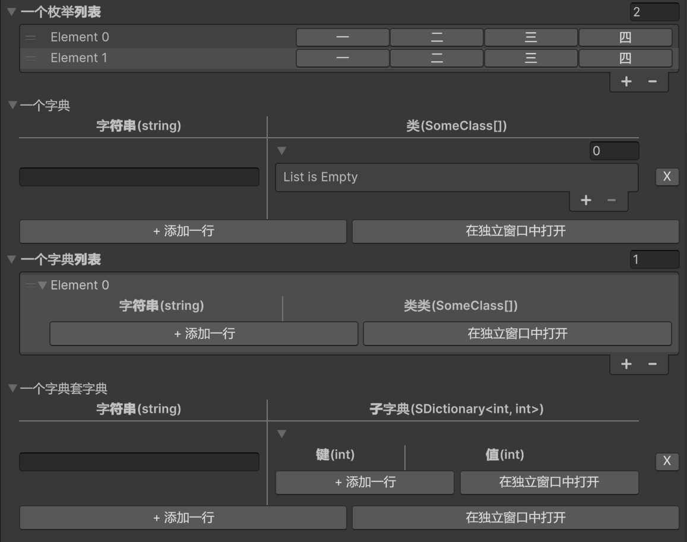

# SKYNET

自己手写了一个unity6的Inspector增强，实现了OdinInspector的几个Attribute。

## 安装
依次执行：
1. unity编辑器中，点击Window - Package Management - Package Manager；
2. 弹出的窗口中点左上角的“+”号，选Install package from git URL，弹出的输入框里输入<https://github.com/skynetXDU/SKYNET2.git>，点右侧Install等待安装即可；

## 主要功能

| 功能 | 用途 |
| --- | --- |
| [InspectorLabel](./Documentation~/InspectorLabel.md) | 为字段设置中文或自定义 Inspector 显示名 |
| [ShowIf](./Documentation~/ShowIf&EnableIf.md) | 根据 bool、enum 或 Flags enum 条件隐藏/显示字段 |
| [EnableIf](./Documentation~/ShowIf&EnableIf.md) | 根据 bool、enum 或 Flags enum 条件启用/禁用字段 |
| [EnumToggleButtons](./Documentation~/EnumToggleButtons.md) | 将 enum 或 Flags enum 绘制成按钮 |
| [TableList](./Documentation~/TableList.md) | 将数组或 `List<T>` 绘制成表格 |
| [TableName](./Documentation~/TableName.md) | 为 `TableList` 中的列设置表头名称 |
| [SDictionary](./Documentation~/SDictionary.md) | 在 Unity Inspector 中序列化字典数据 |
| [SDictionaryLabel](./Documentation~/SDictionaryLabel.md) | 为 `SDictionary` 的 key/value 列设置表头名称 |

## 1️⃣个示例
```csharp
using System;
using System.Collections.Generic;
using System.Reflection;
using UnityEngine;
using SKYNET;

[Flags]
public enum SomeEnumF {
    [InspectorName("一")]
    First=1,
    [InspectorName("二")]
    Second=2,
    [InspectorName("三")]
    Third=4,
    [InspectorName("四")]
    Forth=8
}

public enum SomeEnum {
    [InspectorName("一")]
    First,
    [InspectorName("二")]
    Second,
    [InspectorName("三")]
    Third,
    [InspectorName("四")]
    Forth
}

[Serializable]
public class SomeClass {

    [InspectorLabel("布尔s")]
    public bool field2;

    [InspectorLabel("布尔e")]
    public bool field4;

    [InspectorLabel("整数"), ShowIf("field2"), EnableIf("field4")]
    public int field0;

    [InspectorLabel("字符串")]
    public string field1;

    [InspectorLabel("枚举")]
    [EnumToggleButtons]
    public SomeEnumF field3;

    [InspectorLabel("unity物体")]
    public GameObject field5;

    [InspectorLabel("字符串枚举字典")]
    [SDictionaryLabel("字符串", "枚举")]
    public SDictionary<string, SomeEnum> field6;
}

public class Player : MonoBehaviour {

    [InspectorLabel("一个Flags枚举")]
    [ShowIf("field0")]
    [EnableIf("field1")]
    [EnumToggleButtons]
    public SomeEnumF someEnumF;

    [InspectorLabel("只有包含二才显示")]
    [ShowIf("someEnumF", SomeEnum.Second)]
    public int onlyWhenSecond;

    [InspectorLabel("一个枚举")]
    [EnumToggleButtons]
    public SomeEnum someEnum;

    [InspectorLabel("Player布尔s")]
    [EnumToggleButtons]
    public bool field0;

    [InspectorLabel("Player布尔e")]
    public bool field1;

    [InspectorLabel("一个类")]
    public SomeClass someClass;

    [InspectorLabel("一个列表")]
    [TableList]
    [ShowIf("field0"), EnableIf("field1")]
    public List<SomeClass> someClasses;

    [InspectorLabel("一个枚举列表")]
    [EnumToggleButtons]
    public List<SomeEnumF> someEnums;

    [InspectorLabel("一个字典")]
    [SDictionaryLabel("字符串", "类")]
    public SDictionary<string, SomeClass[]> dict;

    [InspectorLabel("一个字典列表")]
    [SDictionaryLabel("字符串", "类类")]
    public List<SDictionary<string, SomeClass[]>> dictList0;

    [InspectorLabel("一个字典套字典")]
    [TableList]
    [SDictionaryLabel("字符串", "子字典")]
    public SDictionary<string, SDictionary<int, int>> dictList;

}

```

显示效果如下：



